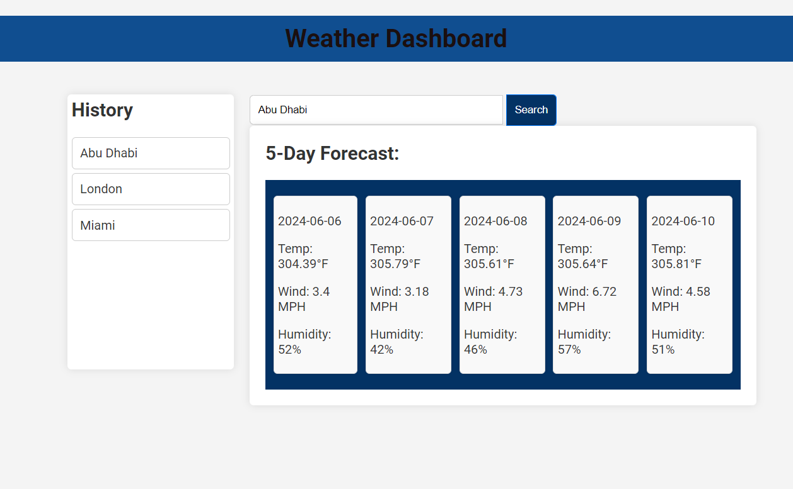

# weather-dashboard
A dynamic weather dashboard that displays current and 5-day weather forecasts for multiple cities using the OpenWeatherMap API. Search for cities to view their weather conditions and store search history with localStorage for quick access.

## Screenshots

### Home Page

### City Weather

## Features
- Search for a city to get current and future weather conditions.
- Display current weather with city name, date, weather icon, temperature, humidity, and wind speed.
- Display a 5-day weather forecast with date, weather icon, temperature, wind speed, and humidity.
- Store search history in localStorage and allow users to click on a city from the history to view its weather conditions again.

## Technologies
- HTML, CSS, JavaScript
- OpenWeatherMap API
- LocalStorage

## How to Use
1. Enter a city name in the search bar and click "Search".
2. View the current weather and 5-day forecast for the city.
3. Click on a city in the search history to view its weather conditions again.
